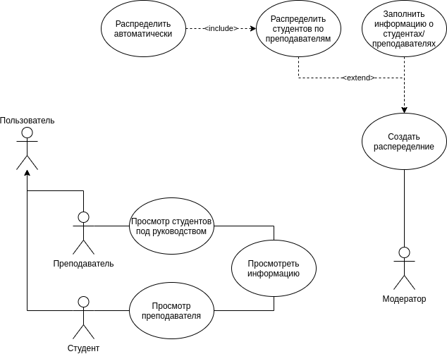

# Веб приложение для распределения руководителей по курсовым/дипломным работам #

### Цель
Реализовать прогрессивное веб приложение для распределения студентов по Дипломным/Курсовым руководителям.

### Функциональные требования
* Веб приложение должно:
    * Работать с списком студентов
        * Иметь возможность массового добавления студентов
        * Иметь возомжность создание, редактирование, удаление студента
    * Работать с списком преподавателей
        * Иметь возможность массового добавления преподавателей
        * Иметь возможность создания, удаления, редактирования отдельного преподавателя
    * По запросу модератора авторматически распределять студентов по преподавателям
    * Работать с организацией структуры распределения
    
### USE CASE Diagram

### ER Diagram

